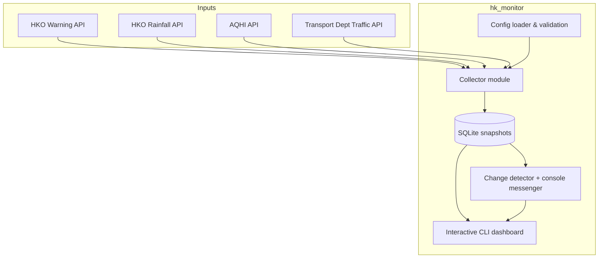

# HK Conditions Monitor – Architecture

## Data flow notes
- Collectors run inside the CLI loop (or scheduler) using the configuration context.
- Each run persists the latest snapshot and reuses SQLite both for persistence and change detection.
- Alerts feed the CLI highlights and console transcript so presenters can narrate incidents directly from the terminal.

## Module responsibilities & entry points
- **`hk_monitor.app`** – The `DashboardSession` class (see `refresh` and `_detect_alerts`) owns the loop shown above: parse CLI flags, collect data, query SQLite for the latest rows, then print and annotate the snapshot.  `build_aqhi_history_report` bridges the persistence layer with the ASCII table rendered in the console.
- **`hk_monitor.collector`** – `collect_once` coordinates `fetch_warning`, `fetch_rain`, `fetch_aqhi`, and `fetch_traffic`.  Each helper converts vendor-specific payloads into the dataclasses exported by `db.py`, handling caching and mock/live toggles along the way.
- **`hk_monitor.db`** – `init_db` and the `save_*`/`get_last_two` helpers are the only modules that talk directly to SQLite.  Timestamps are stored using the shared `ISO_FORMAT` constant so alerts and reports can compare values lexicographically without reparsing.
- **`hk_monitor.alerts`** – `ChangeDetector.run` is the alerting engine.  It reads the newest two rows for each table via `db.get_last_two`, compares their derived category (see `_extract_category`), and emits `AlertMessage` objects through a `Messenger` implementation such as `ConsoleMessenger`.
- **Tests (`hk_monitor/tests`)** – Scenario tests such as `test_scenarios.py` encode the “warning upgrade / AQHI spike / traffic incident” narratives referenced in the project plan.  Treat them as executable documentation when stepping through the architecture diagram.

## Deployment view
- Local execution: `python -m hk_monitor.app` with mock data.
- Production: run collectors via cron/systemd and rely on the CLI for on-demand tiles and alert transcripts.
