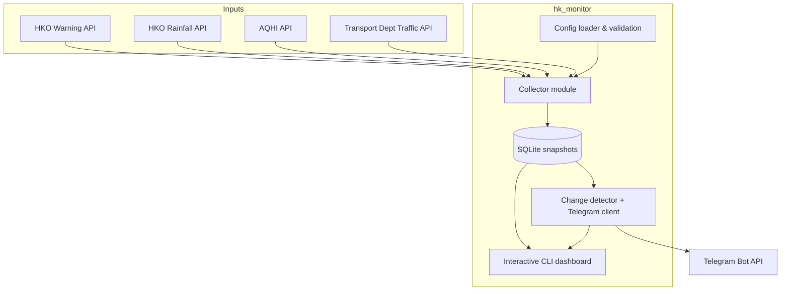

# HK Conditions Monitor – Architecture

## Data flow notes
- Collectors run inside the CLI loop (or scheduler) using the configuration context.
- Each run persists the latest snapshot and reuses SQLite both for persistence and change detection.
- Alerts feed both Telegram (live) and the CLI highlights so presenters can narrate incidents.

## Deployment view
- Local execution: `python -m hk_monitor.app` with mock data.
- Production: run collectors via cron/systemd and forward alerts to Telegram while the CLI offers on-demand tiles.
